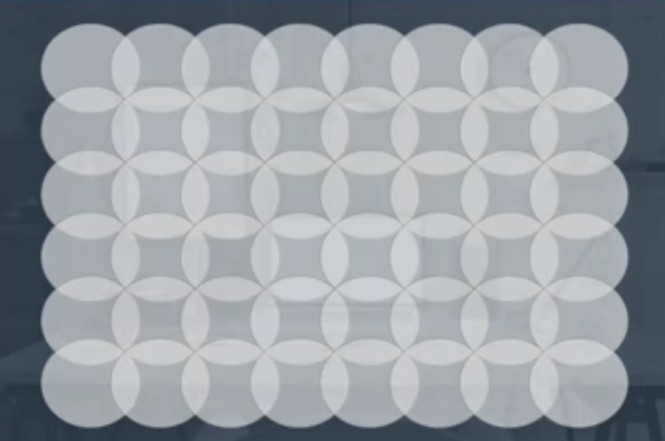
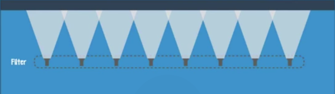
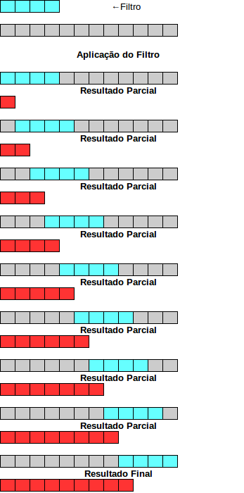
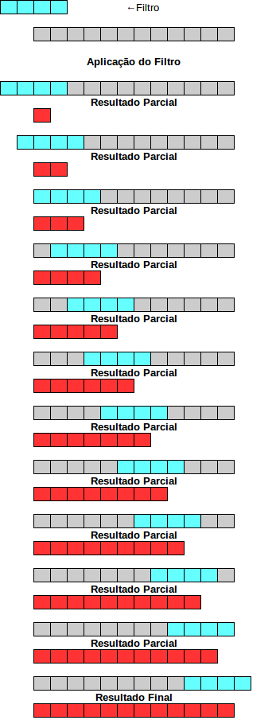
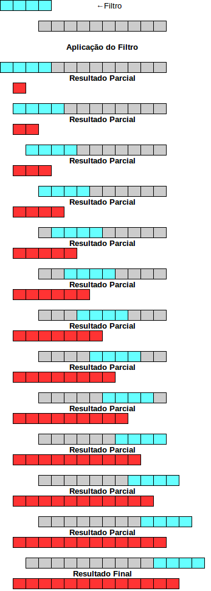
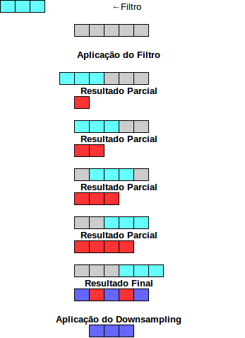
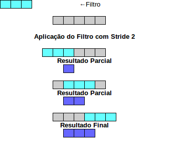
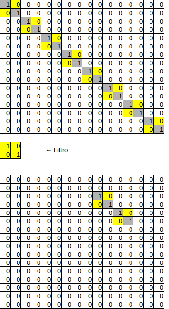
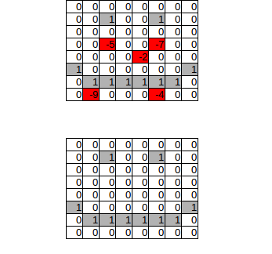

# Deep Learning -- Redes Convolucionais

Inteligencia artificial é uma área que vem crescendo bastante, principalmente depois de 2012 com a disceminação das deep learnings. Isso foi possível, principalmente pelo maior poder de processamento dos hardwares (CPUs e GPUs) e a grande quantidade de dados disponíveis, herdados do big data. 

Essa nova geração de inteligência artificial (IA) é considerada a segunda. Ela é caracterizada pelo forte uso das propriedade da estatística para melhorar a acurácia de seus modelos. Dentro da área de IA temos as redes neurais. As redes neurais são modelos de AI que imitam o cerebro e são utilizadas para resolver diversos problemas, como reconhecimento e segmentação em imagens, predições textuais, reconhecimento de voz, entre outros. Com a acenssão das redes profundas (deep networks) elas começaram a ter sucesso em instâncias mais complexas.

As redes neurais são um conjunto de camadas conectadas que recebe uma entrada, processa por todas as camadas e gera uma saída. Existem diversos tipos de camadas e para cada problema deve-se utilizar a camada mais apropriada. Para o problema de reconhecimento e segmentação de objetos em imagens, as redes convolucionais tem apresentado ótimos resultados.

As redes convolucionais são uma especialização das redes neurais. Essas redes apresentam quatro tipos de camadas, sendo uma delas um classificador, também chamado de camada fully-connected. A arquitetura de uma rede convolucional é formada por um conjunto de camadas (que não sejam o classificador) conectadas e uma última camada com o classificador.

Os outros três tipos de camadas que compõem uma rede convolucional são: camada convolucional, de pooling e de retificação. A seguir será explicado cada uma delas. Para essas explicações, assuma que a entrada é uma imagem em escala de cinzas de 16x16 pixels. Assim, pode-se enxergar a entrada como uma matrix de 16 linhas com 16 colunas. Para simplificar ainda mais, sem perder a generalidade, assuma que cada célula apresenta o valor 1 se apresentar cor e 0 caso contrário.

## Camada Convolucional

A camada convolucional é a aplicação de um pequeno filtro, também chamado de kernel, em várias partes da imagem. Repare que o mesmo filtro é utilizado em todas as partes da imagem. Isso torna esse problema embarassosamente paralelizavel, o que justifica o uso de GPUs para fazer esse processamento. Cada kernel representa uma unidade de processamento, ou seja, um neurônio. A saída desse neurônio será ativada caso a parte da imagem case com o filtro. Na prática, a saída de cada kernel é uma submatriz formada pela multiplicação escalar de cada elemento do kernel pelo elemento correspondente na imagem de entrada.
A imagem abaixo essa ideia usando uma parade representando a entrada e diversas lanternas representando o kerkel.

 Exemplo de filtro convolucional em uma parede observando pela frente. 

 Exemplo de filtro convolucional em uma parede observando por cima. 

Quando se utiliza uma camada convolucional em uma rede, deve-se levar em consideração o problema do "zero-padding". Existem 3 casos a serem levados em consideração, sengundo a nomeclatura do MATLAB, considere um vetor como entrada de tamanho 'm' e um filtro (kernel) de tamanho 'k':
 - Válida (valid)
Neste tipo de convolução, todos os campos do filtro sempre devem estar associados a um elemento da entrada. Com isso, o tamanho do resultado gerado por essa camada será reduzido, ficando um vetor de tamanho 'm'-'k'+1. A figura abaixo demonstra esse comportamento.

 Exemplo de convolução válida. Vetor com tamanho 12 e filtro de tamanha 4, resultando em um vetor de tamanho 12 - (4-1) = 9 .

Isso impacta na definição da arquitetura da rede, pois limita a quantidadade de camadas convolucionais que podem ser utilizadas. Por outro lado, todos os pixels de entrada tem a mesma chance de incluênciar os pixels de saída.

 - Mesma (same)
Neste tipo de convolução, o tamanho da saída será o mesmo da saída. Para isso, é utilizado um artifício onde é aplicado um 'padding' na entrada, assim, nas extremidades o filtro não é aplicado por completo, apenas em alguns pixels da entrada de tal forma, que seja possível criar um vetor de saído de mesmo tamanho que a entrada. A figura abaixo demonstra esse comportamento.

 Exemplo de convolução válida. Vetor com tamanho 12 e filtro de tamanha 4, resultando em um vetor de tamanho 12.

Usando esse tipo de convolução, podemos ter quantas camadas convolucionais o hardware soportar. O problema dessa abordage é que as bordas da entrada são menos favorecidas, pois participam menos da construção do filtro do que os pixels internos. Lembre-se que o filtro aplicado em todas as posições são os mesmos. Dessa forma, utilizando esse tipo de convolução é mais difícil identificar características mapeadas nos extremos da entrada.

 - Completa (full)
Usando esse tipo de convolução, temos a mesma participaçao de todos os pixels de entrada. Isso porque é adicionado um 'padding' que permita isso. Dessa forma, o tamanho da entrada acaba crescendo, ficando com 'm'+'k'-1. A imagem abaixo demonstra esse comportamento.

 Exemplo de convolução completa. Vetor com tamanho 10 e filtro de tamanha 4, resultando em um vetor de tamanho 10 + (4-1) = 13 .

Usando esse tipo de convolução, todos os pixels tem a mesma oportunidade para definir o filtro, porém a saída vai se tornando muito grande. Além disso, a definição do filtro vai se tornando de difícil convergência devido a adição de novas bordas utilizando valores do 'padding'. Em geral, as convoluções mais utilizadas em redes neurais convolucionais (CNN) são: a 'válida' e a 'mesma'.

Para se conseguir a união desses dois tipos de convoluções, de forma eficinte, é necessário utilizar 'stride'. O 'stride' é o que define quantas posições o filtro será deslocado de uma aplicação para outra. Isso também causa um outro efeito chamado 'downsampling'.
O 'downsampling' é o descarte de parte da informação em detrimento de um processamento mais rápido. Isso ocorre quando temos uma redução no tamanho da entrada. A imagem abaixo ilustra esse efeito em dois passos: Processamento de uma convolução 'Mesma' e posteriormente a execução de um 'downsampling' para reduzir o tamanho da saída (assumindo o prejuízo de perda de informação). A imagem logo posterior utiliza o 'stride' para não ser necessário executar o processo intermediário. 

 Exemplo de convolução 'mesma' e aplicação de downsampling para reduzir processamento nas próximas camadas.

 Exemplo de convolução 'mesma' usando stride igual a 2 para simular o downsampling, reduzindo o processamento nas próximas camadas.

É importante notar que usando o stride se utiliza apenas 3 passos, enquanto no outro modo são usados 5 passos. Praticamente 2 vezes mais. 

O uso da camada de convolucional permite encontrar padrões em diferentes posições de uma imagem, resolvendo o problema de identificar o mesmo padrão mesmo existindo translações e mudanças de escala do mesmo. A figura a baixo representa esse poder das camadas convolucionais.
Na figura procuramos um padrão na forma de uma reta rotacionada a um ângulo de 45 graus. O filtro consegue encontrar esse padrão nas duas matrizes, mesmo tendo tamanhos diferentes e estando em posições diferentes da matriz. A seguir será apresentado as outras duas camadas.

 Aplicação da camada convolucional para encontrar padrão em escala e posição diferente.

## Camada de Pooling

A camada de Pooling sempre vai trazer o efeito colateral de reduzi o tamanha da sua entrada. Por exemplo, aplicando uma camada de pooling com kernel de tamanho 2x2 em uma imagem de 16x16, a saída gerado por esta camada será uma imagem de 8x8.

## Camada de retificação

A camada de retificação é a camada mais simples da rede convolucional. Esta camada apenas faz um ajuste em cada posição de sua entrada. A função de ajuste mais utilizada é a RELU. A função desta camada para uma imagem como entrada (matriz de pixels) é fazer um ajuste nos pixels eliminando os valores negativos, visto que os valores válidos para um pixel varia de 0 a 255.

Esses valores inválidos para os pixels podem ser gerados após a aplicação de uma camada de convolução devido aos filtros que vão sendo aprendidos para fazer a transformação dos dados, possibilitando separação das classes.

A figura abaixo mostra o resultado da aplicação de uma camada de RELU em uma matriz que já sofreu o processo de convolução e está com valores inválidos.

 Aplicação da camada RELU para ajustar os valores da matriz para não negativos.

## Codificação
Existem diversos framekorks que podemos utilizar para criar uma rede convolucional. Nesse repositório iremos fazer exemplos com alguns desses frameworks em Python. Novos exemplos com outros frameworks serão adicionados.

* [TensorFlow](tensorflow/)