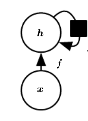
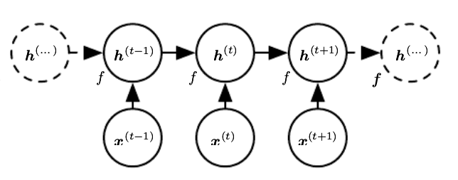

# Redes Neurais Recorrentes

Redes neurais recorrentes são redes onde uma ou mais unidades de processamento (neurônios) tem a sua como uma de suas entradas a sua própria saída. Em redes neurais tradicionais um neurônio pode ser implementado como uma função matemática qualquer que recebe parâmetros externos e produz uma saída (que pode ser usada para alimentar diversos outros neurônios. Por exemplo, um neurônio que tem 4 entradas (X1, X2, X3, X4) pode ser implementado da seguinte maneira:
```
N(X1, X2, X3, X4) = K
```
Onde 'K' é a saída produzida por esse neurônio, onde geralmente é dada por:
```
 [X1, X2, X3, X4] * [N1, N2, N3, N4]^-1 + bias
```
Sendo '[N1, N2, N3, N4]' os filtros do neurônio que devem ser aprendidos e 'bias' um direcionador para o neurônio.

Já em redes neurais recorrentes pelo menos um neurônio deve ser implementado como uma função recursiva, ou seja, uma função que invoca ela mesma. Um exemplo de função recursiva é a do calculo fatorial.

```
Fat(X) =	{
			1		Se X  < 2
			X * Fat(X-1)	Se X >= 2
		}
```
Isso é o que caracteriza as redes neurais recorrentes. Isso é, o uso de algum neurônio que utilize uma função recursiva. A formulação mais comum é a seguinte:

```
h(t) = f(h(t−1) , x(t); θ)
```

Onde 'x(t)' são os parametros externos, 'h(t-1)' é o resultado do último processamento deste neurônio e 'θ' são os filtros que devem ser aprendidos.

## Modos de visualização
### Clássico
No modo clássico, o nó de recorrência é apresentado uma única vez com um laço sobre ele, representando a repetição. A figura seguinte ilustra esse caso.


<p align="center"> Visão clássica.</p>

### Desdobrado (Unfolding)
Nesta visualização é feito a abertura do modelo de tal forma que podemos claramente ver a repetição do neurônio no passar do tempo. A figura seguinte ilustra esse caso.


<p align="center"> Visão desdobrada.</p>
